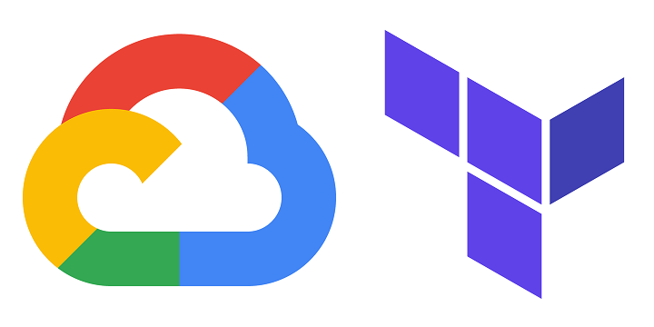
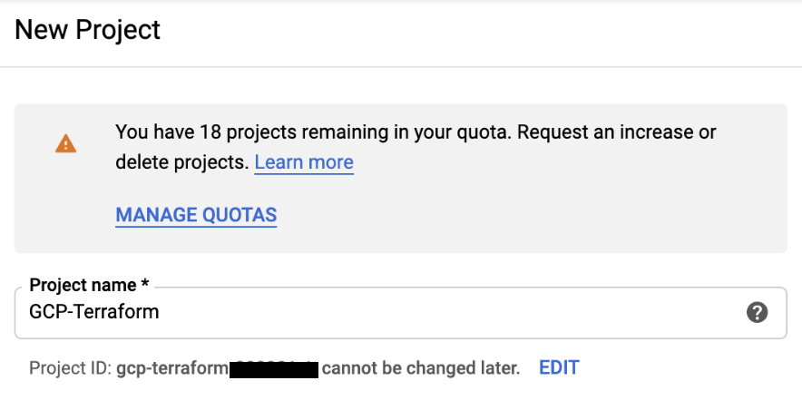
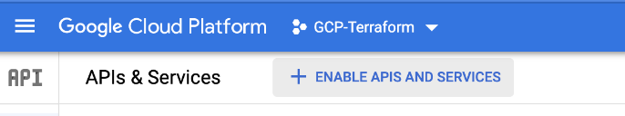
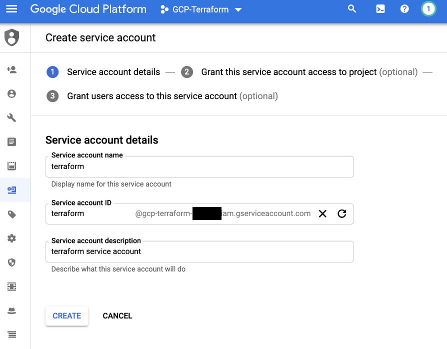

# Terraform GCP 
This repo contains sets of simple Terraform IaC for Google Cloud 
## Description
Service:
 * [Terraform](https://www.terraform.io/) - Cloud Agonistic Infrastructure as Code (IaC) service
 
Cloud Provider: 
 * [GCP](https://cloud.google.com/gcp) - Cloud Infrastructure Provider on Google Platform

## Project Structure
The infrastructure for the project is as defined below.
```
├── README.md <-------------- This guide to the project.
├── terraform_vm_vpc<------------ Contains terraform code for creating a GCP Virtual Machine and Virtual Private Cloud
└──imgs <------------------ images for README.md
```

## Prereqs
- A GCP Account and Project

- GCP APIs Enabled: 
    - Cloud Resource Manager API, Cloud Compute Engine API, Cloud Storage API, Cloud IAM API, & Cloud Billing

- GCP Service Account:
    - Role: Project Editor Role 
    - Service Account Admin Role: Your Email Address
    - After you create a sercvice account, generate the JSON key

- Install GCP SDK 
    -   `brew cask install google-cloud-sdk`
- Create a GCP bucket 
    - This bucket will hold the terraform state file
    - All buckets must have a unique name
    - Create a folder within the bucket named `terraform1`
